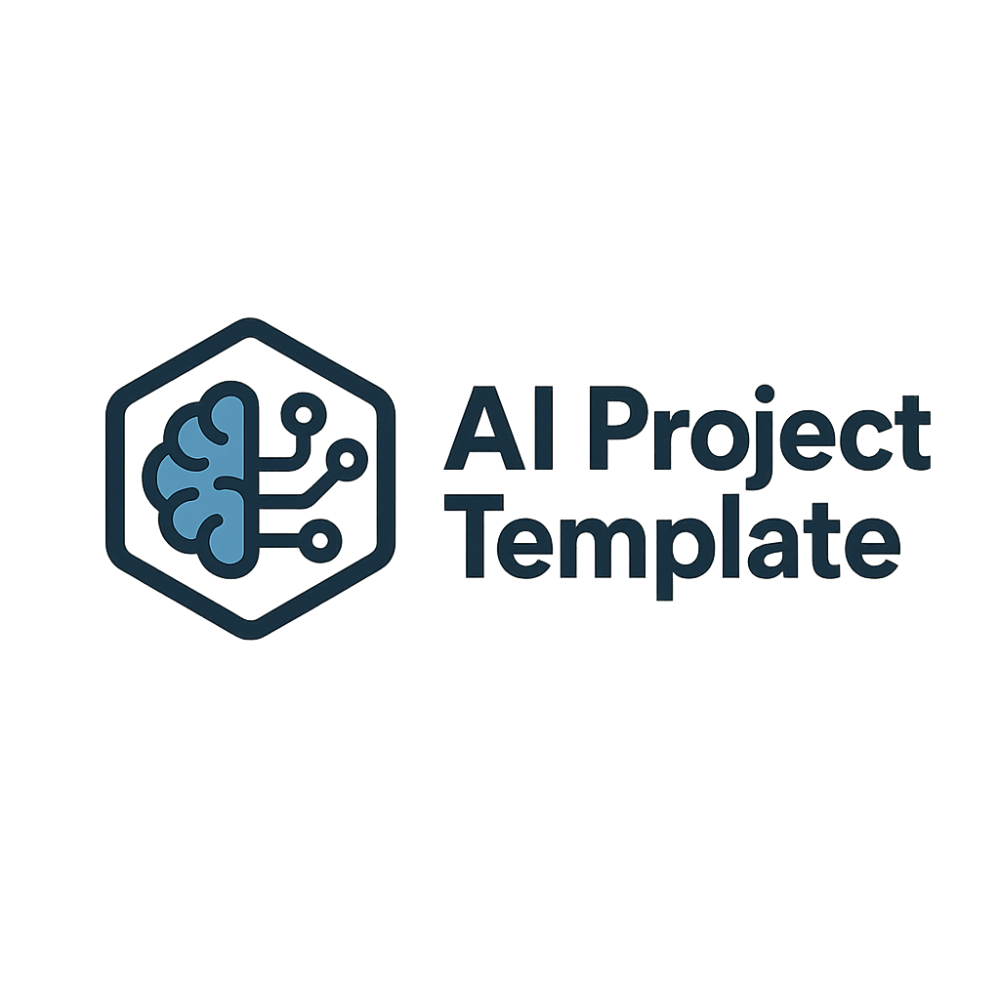

📘 AI Project Template

  
 
 🚀 A reusable and scalable template for AI & Data Engineering projects, designed with best practices for MLOps and DataOps. 
 
     

✨ Why this template?

This project template gives you a production-ready structure for AI & Data Engineering projects.
No need to reinvent the wheel — just clone and start building.

Key Benefits:

⚡ 2–3x faster start – skip boilerplate setup

🔧 General-purpose – works for Data, ML, and AI projects

📈 Scalable – compatible with Databricks, Azure, Docker, Kubernetes

🔒 Best practices – CI/CD, monitoring, reproducibility, data quality

📂 Project Structure
ai-project-template/
├─ configs/           # Configurations (Hydra, logging, training, data)
├─ data/              # Data (raw, interim, processed) – DVC supported
├─ docs/              # Documentation (MkDocs or Sphinx)
├─ notebooks/         # Jupyter/Colab notebooks for exploration
├─ reports/           # Generated reports, figures, metrics
├─ src/               # Source code (data, features, models, pipelines)
├─ scripts/           # CLI scripts (train, evaluate, predict)
├─ tests/             # Unit & integration tests
├─ deployments/       # Deployment configs (Docker, K8s, Azure, CI/CD, serving)
├─ monitoring/        # Dashboards, logs, alerts
├─ expectations/      # Data quality checks (Great Expectations)
├─ mlruns/            # MLflow tracking
└─ model_registry/    # Model promotion (staging → prod)

🚀 Quick Start

Clone the repo and install dependencies:

git clone https://github.com/your-username/ai-project-template.git
cd ai-project-template
pip install -r requirements.txt

Train your first model:

python scripts/train_model.py +experiment.name=baseline_run

Run evaluation:

python scripts/evaluate_model.py

🔧 Example Code
from your_project.data.loaders import load_csv_dataset
from your_project.features.build_features import build_basic_features

df = load_csv_dataset("data/raw/sample.csv")
X, y = build_basic_features(df)

print("Features shape:", X.shape)

📖 Documentation

Project Architecture

Data Engineering Guide

Deployment Guide

👩‍💻 Author

Created by EL MAHDI EL AIMANI
AI & Data Engineer | AI & Data Enthusiast

LinkedIn : https://www.linkedin.com/in/el-mahdi-el-aimani-bb5555227/

GitHub : https://github.com/Mahdielaimani

✨ If you like this project, don’t forget to star ⭐ the repo!